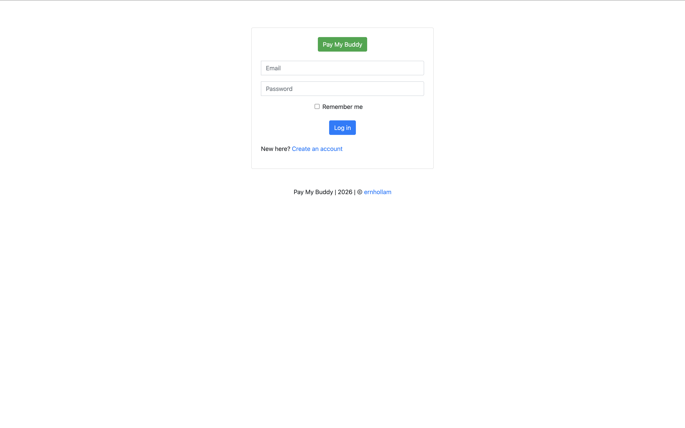

# PayMyBuddy — Conteneurisation avec Docker

Mini-projet Docker du bootcamp EazyTraining : conteneurisation de l'application **PayMyBuddy** (backend Spring Boot + base MySQL), orchestration avec **Docker Compose** et distribution des images via un **registry Docker privé**.

**Auteur :** Birame — birametgod95@gmail.com

---

## Sommaire

1. [Architecture](#architecture)
2. [Structure du dépôt](#structure-du-dépôt)
3. [Prérequis et lancement rapide](#prérequis-et-lancement-rapide)
4. [Étape 1 — Build et test](#étape-1--build-et-test)
5. [Étape 2 — Orchestration avec Docker Compose](#étape-2--orchestration-avec-docker-compose)
6. [Étape 3 — Registry Docker privé](#étape-3--registry-docker-privé)
7. [Sécurisation des identifiants](#sécurisation-des-identifiants)
8. [Problèmes rencontrés et solutions](#problèmes-rencontrés-et-solutions)
9. [Pistes d'amélioration](#pistes-damélioration)

---

## Architecture

```
                    Navigateur
                        │  http://localhost:8080
                        ▼
┌──────────────────── réseau Docker : app-network ────────────────────┐
│                                                                     │
│   ┌──────────────────────┐      JDBC        ┌──────────────────────┐│
│   │  paymybuddy-backend  │ ───────────────► │    paymybuddy-db     ││
│   │  Spring Boot (8080)  │  (port 3306)     │   MySQL 8.0 (3306)   ││
│   └──────────────────────┘                  └──────────┬───────────┘│
│                                                        │            │
└────────────────────────────────────────────────────────┼────────────┘
                                                         │
                          volume nommé datadir ──► /var/lib/mysql   (persistance)
                          bind mount ./initdb  ──► /docker-entrypoint-initdb.d (init du schéma)

┌──────────── réseau Docker : pozos-registry-network ─────────────┐
│   registry:3 (localhost:5002)  ◄────  registry-ui (localhost:8090)│
└─────────────────────────────────────────────────────────────────┘
```

| Service | Image | Port exposé | Rôle |
|---|---|---|---|
| `paymybuddy-backend` | `localhost:5002/backendimage:v1` | 8080 | Application web Spring Boot |
| `paymybuddy-db` | `localhost:5002/mysql:8.0` | — (réseau interne) | Stockage des utilisateurs, comptes et transactions |
| `registry` | `registry:3` | 5002 | Registry privé |
| `registry-ui` | `joxit/docker-registry-ui` | 8090 | Interface web du registry |

La base de données n'est **pas publiée** sur l'hôte : seul le backend y accède, via le réseau interne `app-network`.

---

## Structure du dépôt

```
mini-projet-docker/
├── Dockerfile                    # Image du backend
├── docker-compose.yml            # Stack applicative (backend + db)
├── docker-compose-registry.yml   # Registry privé + interface web
├── .env.example                  # Modèle des variables d'environnement (à copier en .env)
├── .gitignore                    # Exclut .env du dépôt
├── .dockerignore                 # Exclut .git et .env du contexte de build
├── initdb/
│   └── create.sql                # Création de la base, des tables et des données de test
├── target/
│   └── paymybuddy.jar            # Application compilée
├── src/                          # Code source Spring Boot
└── screenshots/                  # Captures d'écran de la livraison
```

---

## Prérequis et lancement rapide

**Prérequis :** Docker Engine et Docker Compose v2.

```bash
# 1. Créer le fichier de variables à partir du modèle, puis y mettre un vrai mot de passe
cp .env.example .env

# 2. Démarrer le registry privé
docker compose -f docker-compose-registry.yml up -d

# 3. Démarrer l'application (images tirées depuis le registry)
docker compose up -d

# 4. Vérifier
docker compose ps
```

L'application est accessible sur **http://localhost:8080** et le registry sur **http://localhost:8090**.

---

## Étape 1 — Build et test

### Dockerfile du backend

```dockerfile
FROM amazoncorretto:17-alpine

COPY target/paymybuddy.jar .

EXPOSE 8080

CMD ["java", "-jar", "paymybuddy.jar"]
```

| Instruction | Justification |
|---|---|
| `FROM amazoncorretto:17-alpine` | JDK 17 imposé par l'application, variante Alpine pour une image légère |
| `COPY target/paymybuddy.jar .` | Le JAR est déjà compilé : pas besoin de Maven dans l'image |
| `EXPOSE 8080` | Port d'écoute de Tomcat (documentation de l'image) |
| `CMD [...]` | Forme *exec* : Java est le PID 1 et reçoit directement les signaux d'arrêt |

Aucun identifiant n'est écrit dans le Dockerfile : ils sont fournis **au lancement** (voir [Sécurisation](#sécurisation-des-identifiants)).

```bash
docker build -t backendimage:v1 .
```

### Base de données MySQL

La base utilise l'**image officielle `mysql:8.0`**, sans Dockerfile dédié. Elle est configurée au lancement :

- **`/docker-entrypoint-initdb.d`** : au premier démarrage, l'entrypoint MySQL exécute les scripts `.sql` présents dans ce dossier. Le dossier `initdb/` y est monté, ce qui crée la base `db_paymybuddy`, ses tables et des données de test.
- **`/var/lib/mysql`** : dossier de données de MySQL, monté sur un volume nommé pour la persistance.

### Test manuel avec `docker run`

Avant d'écrire le Compose, les deux conteneurs ont été validés à la main :

```bash
docker network create app-network

docker run -d --name mysqldatabase --network app-network \
  -v datadir:/var/lib/mysql \
  -v $(pwd)/initdb:/docker-entrypoint-initdb.d \
  -e MYSQL_ROOT_PASSWORD=<mot-de-passe> \
  mysql:8.0

docker run -d --name backendpaymybuddy --network app-network -p 8080:8080 \
  -e SPRING_DATASOURCE_USERNAME=root \
  -e SPRING_DATASOURCE_PASSWORD=<mot-de-passe> \
  -e SPRING_DATASOURCE_URL=jdbc:mysql://mysqldatabase:3306/db_paymybuddy \
  backendimage
```

Lignes de logs qui valident chaque étape :

| Conteneur | Log | Signification |
|---|---|---|
| MySQL | `running /docker-entrypoint-initdb.d/create.sql` | Le script d'init est bien lu |
| MySQL | `ready for connections ... port: 3306` | Le serveur définitif est prêt |
| Backend | `HikariPool-1 - Start completed.` | La connexion à MySQL fonctionne |
| Backend | `Started PayMyBuddyApplication` | L'application est démarrée |


![Page d'accueil après connexion] 


---

## Étape 2 — Orchestration avec Docker Compose

```yaml
services:
  paymybuddy-backend:
    image: localhost:5002/backendimage:v1
    ports:
      - 8080:8080
    restart: always
    depends_on:
      - paymybuddy-db
    networks:
      - app-network
    environment:
      - SPRING_DATASOURCE_USERNAME=${SPRING_DATASOURCE_USERNAME}
      - SPRING_DATASOURCE_PASSWORD=${SPRING_DATASOURCE_PASSWORD}
      - SPRING_DATASOURCE_URL=jdbc:mysql://paymybuddy-db:3306/db_paymybuddy
  paymybuddy-db:
    image: localhost:5002/mysql:8.0
    volumes:
      - datadir:/var/lib/mysql
      - ./initdb:/docker-entrypoint-initdb.d
    environment:
      - MYSQL_ROOT_PASSWORD=${SPRING_DATASOURCE_PASSWORD}
    networks:
      - app-network

networks:
  app-network:
    driver: bridge

volumes:
  datadir:
```

### Choix techniques

| Élément | Choix | Justification |
|---|---|---|
| Nom d'hôte de la base | `paymybuddy-db` | Dans un réseau Compose, chaque service est joignable par **son nom de service** (DNS interne de Docker) |
| Données MySQL | Volume nommé `datadir` | Géré par Docker, indépendant de l'arborescence de l'hôte, il survit à `docker compose down` |
| Scripts d'init | Bind mount `./initdb` | Chemin relatif résolu par Compose depuis le dossier du fichier |
| Ordre de démarrage | `depends_on` | La base démarre avant le backend |
| Redémarrage | `restart: always` sur le backend | MySQL met ~30 s à s'initialiser : si le backend démarre trop tôt, il échoue puis est relancé automatiquement jusqu'à ce que la base soit prête |
| Mot de passe root | Même variable que le backend | Une seule source de vérité : les deux valeurs ne peuvent pas diverger |

### Vérification de la persistance

```bash
docker compose down        # sans -v : le volume est conservé
docker compose up -d
```

Le compte utilisateur créé avant le `down` est toujours présent après le redémarrage.


---

## Étape 3 — Registry Docker privé

### Déploiement du registry

Le fichier `docker-compose-registry.yml` déploie :

- **`registry:3`** : le registry, publié sur le port **5002**. Le port 5000 est occupé sur macOS par le récepteur AirPlay. Les images sont stockées dans le volume `registry-data`.
- **`joxit/docker-registry-ui`** : une interface web sur le port **8090**, qui interroge le registry via le réseau interne (`NGINX_PROXY_PASS_URL=http://registry:5000`).

```bash
docker compose -f docker-compose-registry.yml up -d
```

### Publication des images

Pour pousser une image vers un registry, son nom doit commencer par **l'adresse du registry**. C'est ce préfixe qui indique à Docker où envoyer l'image.

```bash
# Backend : image construite localement
docker tag backendimage:v1 localhost:5002/backendimage:v1
docker push localhost:5002/backendimage:v1

# MySQL : image officielle re-taggée
docker tag mysql:8.0 localhost:5002/mysql:8.0
docker push localhost:5002/mysql:8.0

# Vérification
curl http://localhost:5002/v2/_catalog
```

Pour MySQL, l'image officielle a été re-taggée telle quelle. Elle ne contient donc pas le script SQL, qui reste monté par Compose depuis `./initdb`.

### Déploiement depuis le registry

Dans `docker-compose.yml`, les deux services utilisent les images du registry (`localhost:5002/...`). Pour prouver que Compose les télécharge bien depuis le registry, les images locales sont supprimées avant le lancement :

```bash
docker compose down
docker rmi localhost:5002/backendimage:v1 localhost:5002/mysql:8.0
docker compose up -d    # affiche "Pulling" depuis localhost:5002
```


---

## Sécurisation des identifiants

Les identifiants ne sont écrits ni dans le Dockerfile ni dans `docker-compose.yml`.

- Le fichier **`.env`** contient les vraies valeurs. Docker Compose le lit automatiquement et remplace les références `${...}`.
- **`.env` est exclu de Git** (`.gitignore`) : les mots de passe ne sont jamais poussés sur le dépôt.
- **`.env` est exclu du contexte de build** (`.dockerignore`) : il ne peut pas se retrouver dans une image.
- **`.env.example`** est versionné : il liste les variables attendues, avec des valeurs fictives.

```bash
# .env.example
SPRING_DATASOURCE_USERNAME=root
SPRING_DATASOURCE_PASSWORD=change-me
```

**Pourquoi ne pas utiliser `ENV` dans le Dockerfile ?** Une valeur définie avec `ENV` est gravée dans l'image. Toute personne qui récupère l'image depuis le registry peut la lire avec `docker inspect`.

**Comment l'application reçoit sa configuration.** Le JAR ne contient aucun `application.properties`. Spring Boot convertit automatiquement les variables d'environnement en propriétés : `SPRING_DATASOURCE_URL` devient `spring.datasource.url`.

---

## Problèmes rencontrés et solutions

| Problème | Cause | Solution |
|---|---|---|
| `Failed to configure a DataSource: 'url' attribute is not specified` | Le JAR ne contient aucune configuration de connexion à la base | Fournir `SPRING_DATASOURCE_URL`, `_USERNAME` et `_PASSWORD` au conteneur |
| L'URL JDBC ne fonctionnait pas avec `-e SPRING_DATASOURCE_URL` | Sans `=valeur`, Docker reprend la variable de l'hôte, qui n'existe pas | Écrire `-e NOM=valeur` |
| Application injoignable avec `-p 8080:81` | Tomcat écoute sur 8080 dans le conteneur, pas sur 81 | `-p 8080:8080` (format `hôte:conteneur`) |
| Montage du script d'init refusé | Chemin conteneur sans `/` initial, et fichier monté sur un dossier | `-v $(pwd)/initdb:/docker-entrypoint-initdb.d` |
| `$(pwd)` dans le Compose | Syntaxe shell, non interprétée par Compose | Chemin relatif `./initdb` |
| Données non persistées | Volume monté sur `/var/lib/sql` au lieu de `/var/lib/mysql` : MySQL écrivait dans un volume anonyme | Monter le volume sur `/var/lib/mysql` |
| Échec de l'init avec `MYSQL_DATABASE=db_paymybuddy` | L'entrypoint crée la base, puis `create.sql` tente un `CREATE DATABASE` sur une base qui existe déjà | Supprimer `MYSQL_DATABASE` et laisser le script créer la base |
| `Bad credentials` avec `security@mail.com` | Les mots de passe des comptes de test sont stockés en hash BCrypt, à sens unique, et leur valeur en clair n'est pas fournie | Créer un compte via la page d'inscription |
| Le script d'init ne se rejoue pas | Il ne s'exécute que si le volume de données est vide | `docker compose down -v` pour repartir de zéro |
| Le backend démarre avant que MySQL soit prêt | `depends_on` attend que le conteneur soit démarré, pas que le service soit prêt | `restart: always` sur le backend |
| Avertissement multi-plateforme au `push` de MySQL | Seule la variante `arm64` (Mac Apple Silicon) avait été téléchargée | Sans impact en local (voir pistes d'amélioration) |

---
